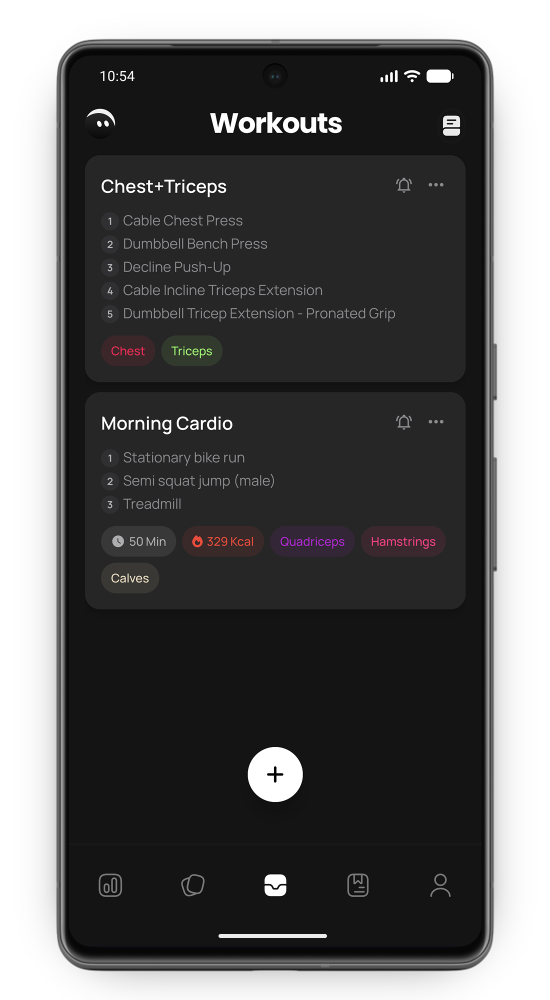
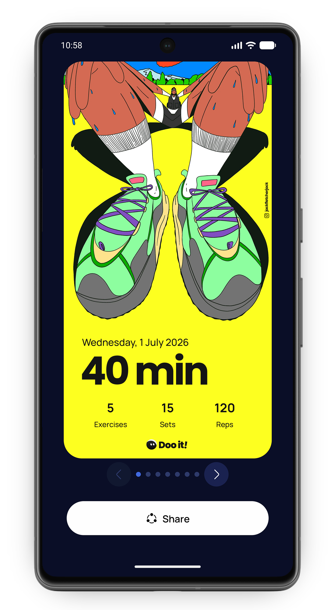
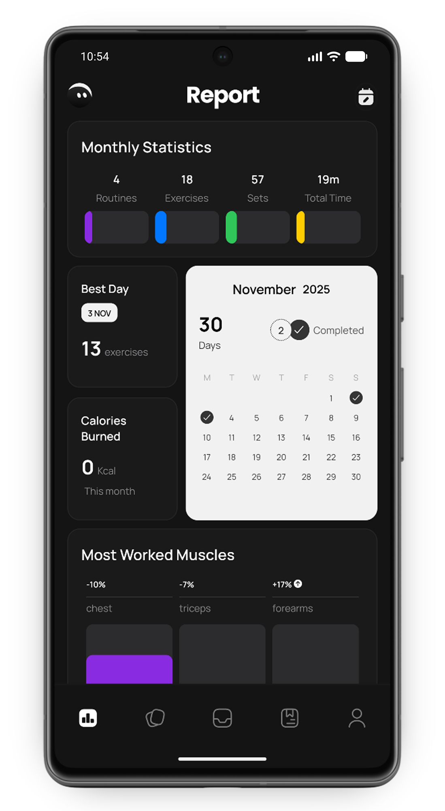
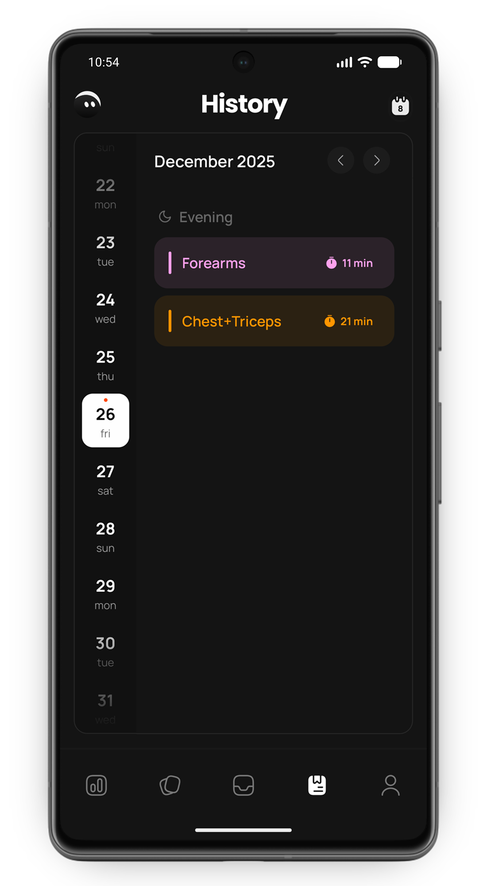
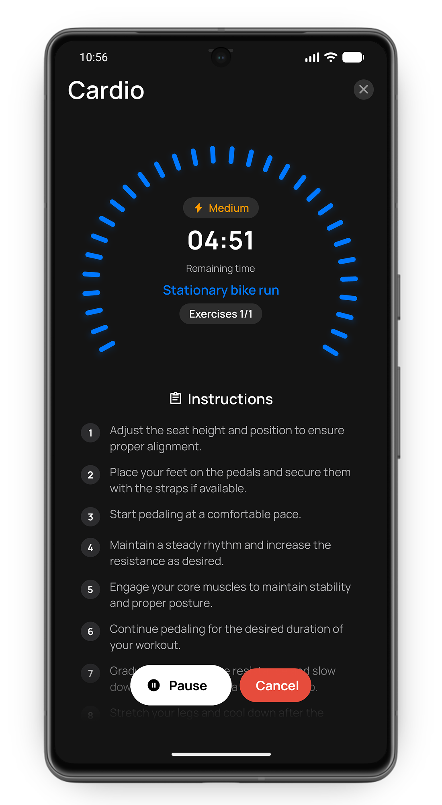
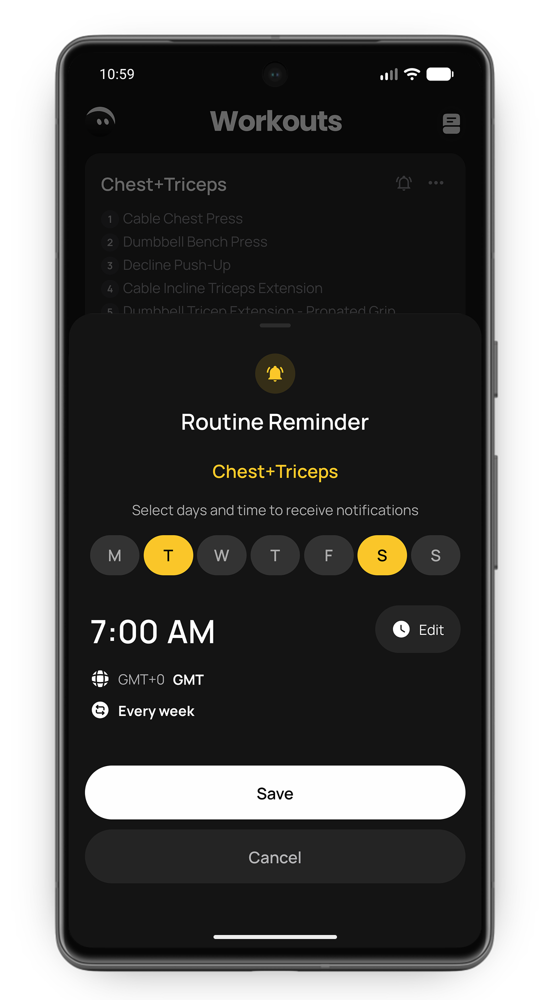
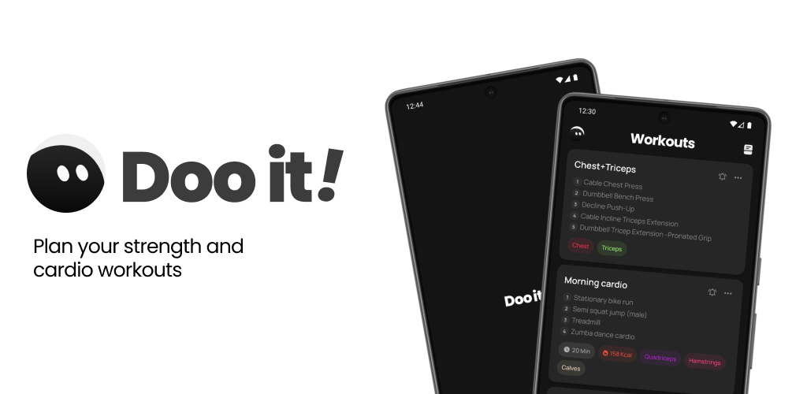

 

# Doo It!

### Plan your strength and cardio workouts

Doo it! is an offline mobile app that lets users create workout routines and track their exercises.
The main goal is to offer a free, subscription-free, and offline option so that users can access it anytime, anywhere, since all the information is stored on the device.

### Screenshots

 

### Features

- Create workout routines (strength and cardio)
- Database with over 800 exercises
- Customized workouts
- Track reps, sets, and time
- Workout charts and statistics
- Workout history
- Share completed routines
- Achievements and medals for completing workouts
- Set reminders or notifications for routines

### Download

Get the latest APK from the Releases section.

### Privacy Policy

To learn more about our privacy policy, please click the link. 

## License

This project is proprietary software.
The source code is not publicly available.
All rights reserved.

